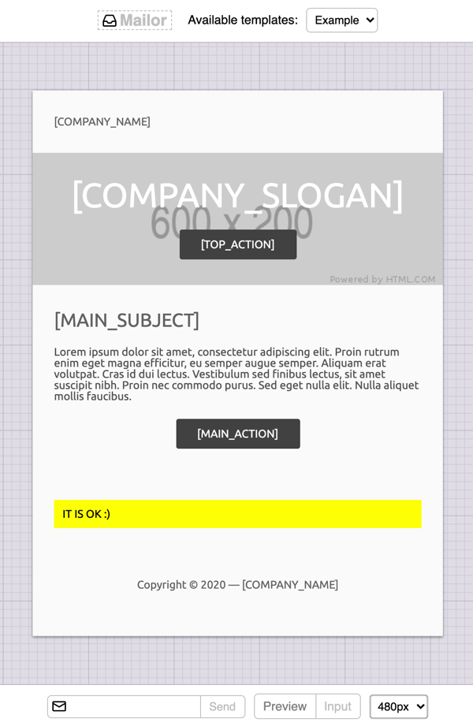
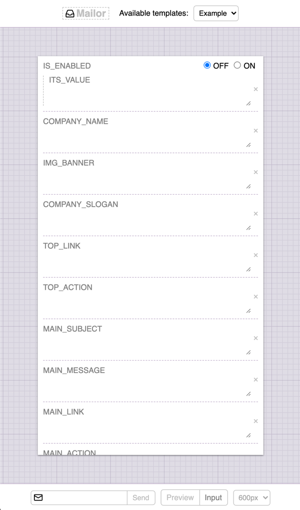

# Mailor

> This module glues Maildev and MJML with some Pug and Mustache to enable an easier development workflow for mailings on NodeJS.

<div align="center">


[](http://badge.fury.io/js/mailor)
[](https://github.com/tacoss/mailor/actions)
[](https://codecov.io/github/tacoss/mailor)
[](https://snyk.io/test/npm/mailor)

</div>

Get it globally or within your project:

```bash
$ npm i -g mailor # or `npm i mailor --save-dev`
```

> Use `mailor init` to create a `templates/` directory with an example.pug ready play with!

Now, you can start creating templates using pure `.pug` files:

**templates/test1.pug**
```pug
mjml
  Body: Section
    Column: Text
      h1 It works!
```

> Shortcuts for `mj-*` tags are provided as `<Column />` to produce `<mj-column />` respectively
> &mdash; those _tags_ supports the `class` attribute by default while `mj-*` requires `css-class` instead.

### Build or watch for changes, e.g.

```bash
$ mailor watch templates -d generated --no-open
```

Once built, try sending it through the local SMTP, e.g.

```bash
$ mailor send generated/test1.html
```

Open http://localhost:1081 and see how it looks!

### LESS.js support

You can pre-process and embed the resulting stylesheet through LESS, e.g.

```pug
mjml
  Head
    Style(src='_your_stylesheets.less')
```

> The `src` attribute used here is non MJML standard, so `mj-style` won't work the same way
> &mdash; also, if your file is not `.less` then it'll be embedded without changes.

### Including files

By default all files or directories starting with `_` are ignored by the compiler, e.g.

```pug
mjml
  Head
    include _/header
```

### Live preview

<table>
  <tr><td>
    
  </td><td>
    
  </td></tr>
</table>

The included live-preview app allows you to watch your generated templates,
input variables are extracted directly from your templates so you can test with real data.

> You can leverage on the `jsonfile` option to setup default variables too
> &mdash; notice that on Mustache some values can be objects, arrays or functions.

## API

By default `maildev` is enabled when watch mode is used.

The `send` command uses `nodemailer` for sending messages through.

You can, however, reuse this module too:

```js
const nodemailer = require('nodemailer');

const mailer = require('mailor').getMailer({
  transport: nodemailer.createTransport(...),
  internalErrors: [],
});

mailer.sendMail({
  template: 'path/to/tpl.html',
  subject: 'Test',
  email: 'test@example.com',
  data: { ... },
});
```

You MUST provide a working `transport` and optionally a list of internal error messages to be aware of, if any matches an exception will be thrown.

### Using input

Local variables are given as `data` and they're rendered by Mustache to build the message to be sent.

Locals for pug-templates MUST be provided as values during `mailor` invocation, e.g.

```bash
$ mailor build templates -d generated username="John Doe" token="x-f4c8"
```
